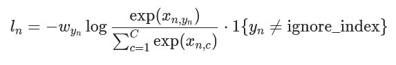

# Przygotowanie

Zdecydowaliśmy się skorzystać z biblioteki pytorch, aby stworzyć nasz model. Korzysta on z kilku warstw konwolucyjnych, ReLU, MaxPool i transformacji liniowych, aby sklasyfikować obrazek.

## Ocena modelu

Do oceny modelu wybraliśmy następujące metryki:

#### Loss (funkcja straty)

Funkcja straty Cross Entropy

$$\frac{1}{N} \sum_{n=1}^{N} \log \left( \frac{\exp(x_{n, y_n})}{\sum_{c=1}^{C} \exp(x_{n, c})} \right) \cdot \mathbf{1}\{y_n \ne \text{ignore\_index}\}  $$

#### Accuracy (dokładność)

Dokładność określa, jaka część spośród przypadków została poprawnie sklasyfikowana

$$ \text{Dokładność} = \frac{Liczba poprawnie sklasyfikowanych przypadków}{Liczba wszystkich przypadków}$$

#### F-score

F-Score to średnia harmoniczna precyzji (precision) i czułości (recall). Te miary są wykorzystywane dla klasyfikacji binarnej, więc przy określaniu każdej z nich wybieramy konkretną klasę, i dla niej wyznaczamy współczynniki TP, FP, TN, FN (True Positive, False Positive, True Negative, False Negative).

Precyzja określa, jak wiele spośród elementów sklasyfikowanych jako dana klasa należy do tej klasy.

$$\text{Precyzja} = \frac{TP}{TP + FP}$$

Czułość określa, jak wiele spośród próbek o danej klasie zostało poprawnie sklasyfikowanych.

$$\text{Czułość} = \frac{TP}{TP + FN}$$

Dla problemów wieloklasowych, takich jak nasz, bierzemy średnią ważoną F-score obliczonego dla każdej klasy.

#### ROC AUC

ROC - Receiver Operating Characteristic to wykres krzywej czułości ($TP/(TP + FN)$) względem swoistości ($TN/(FP + TN)$) klasyfikatora binarnego. AUC (Area Under Curve) to pole pod tą krzywą, które dla idealnego klasyfikatora powinno wynosić 1, a dla losowego 0.5.

Dla wielu klas korzystamy z metody "one vs rest", która wyznacza krzywe po kolei dla każdej klasy, pozostałe klasy są liczone jako wyniki negatywne. Wynik uśredniamy dwiema metodami

- micro-averaging - Każda próbka jest brana z osobna do wyliczenia całkowitej wartości metryki dla wielu klas. Liczebność klas wpływa tu na wynik.
- macro-averaging - Wyliczamy średnią nieważoną z wyników dla każdej klasy

#### Confusion matrix (Tablica pomyłek)

Tablica pomyłek to tablica, w której wiersze to poprawne klasy próbek, a kolumny to przypisanie do tych klas przez nasz algorytm. Liczby poprawnie sklasyfikowanych przypadków znajdują się na głównej przekątnej. Dzięki niej można zobaczyć, jakie klasy są najczęściej mylone z innymi.

#### $R^2$
