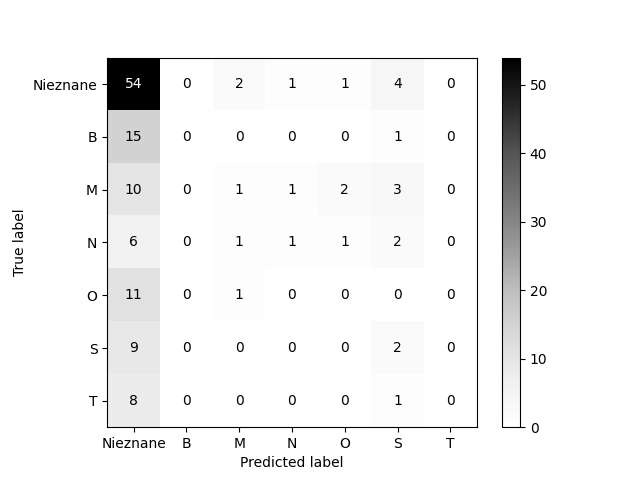

## Wykresy

Wykresy metryk podstawowego modelu (lr=0.01,momentum=0) dla danych walidacyjnych po 20 epokach wyglądają następująco:

<!-- Funkcja straty: -->

\begin{center}
\includegraphics[width=0.9\textwidth]{img/lr=0.01/plot_train_loss.png}
\\
Wykres funkcji straty w zależności od epoki (dane treningowe).
\end{center}

<!-- Dokładność: -->

\begin{center}
\includegraphics[width=0.9\textwidth]{img/lr=0.01/plot_accuracy.png}
\\
Wykres dokładności (accuracy) w zależności od epoki.
\end{center}

<!-- Precyzja: -->

\begin{center}
\includegraphics[width=0.9\textwidth]{img/lr=0.01/plot_precision.png}
\\
Wykres precyzji w zależności od epoki.
\end{center}

<!-- Czułość: -->

\begin{center}
\includegraphics[width=0.9\textwidth]{img/lr=0.01/plot_recall.png}
\\
Wykres czułości w zależności od epoki.
\end{center}

<!-- F-score -->

\begin{center}
\includegraphics[width=0.9\textwidth]{img/lr=0.01/plot_f1.png}
\\
Wykres F-score w zależności od epoki.
\end{center}

<!-- ROC AUC (micro-averaging) -->

\begin{center}
\includegraphics[width=0.9\textwidth]{img/lr=0.01/plot_roc_auc_micro.png}
\\
Wykres ROC AUC (micro-averaging) w zależności od epoki.
\end{center}

<!-- ROC AUC (macro-averaging) -->

\begin{center}
\includegraphics[width=0.9\textwidth]{img/lr=0.01/plot_roc_auc_macro.png}
\\
Wykres ROC AUC (macro-averaging) w zależności od epoki.
\end{center}

<!-- Tablica pomyłek na zbiorze walidacyjnym -->
<!--
\begin{center}
\includegraphics[width=0.9\textwidth]{img/lr=0.01/confusion_matrix.png}
\\
Tablica pomyłek na zbiorze walidacyjnym
\end{center} -->

<!-- \begin{center}
\includegraphics[width=0.8\textwidth]{img/lr=0.01/plot_roc_auc_micro.png}
\end{center}

\begin{center}
\includegraphics[width=0.8\textwidth]{img/lr=0.01/plot_roc_auc_micro.png}
\end{center} -->

